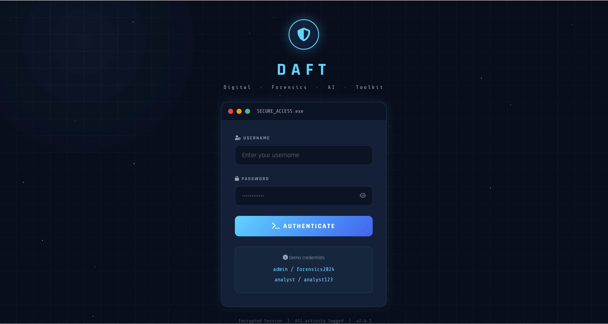
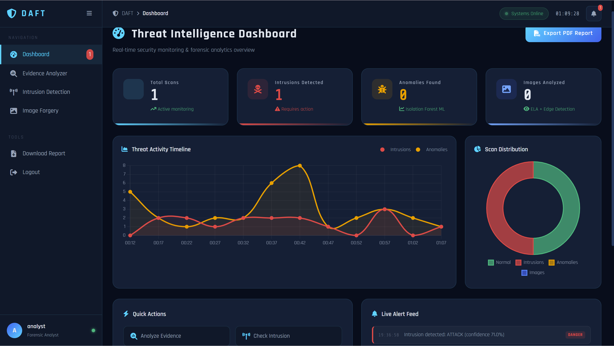
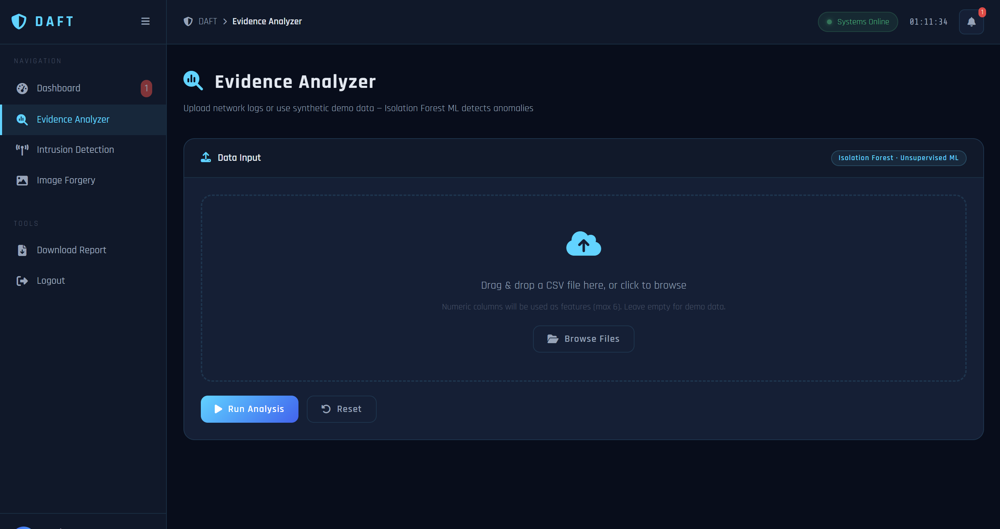
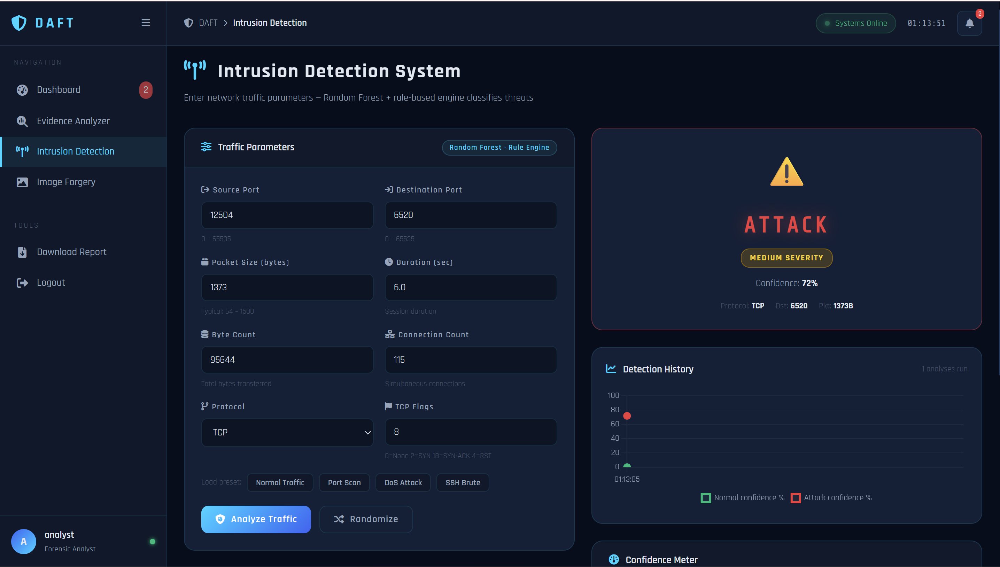
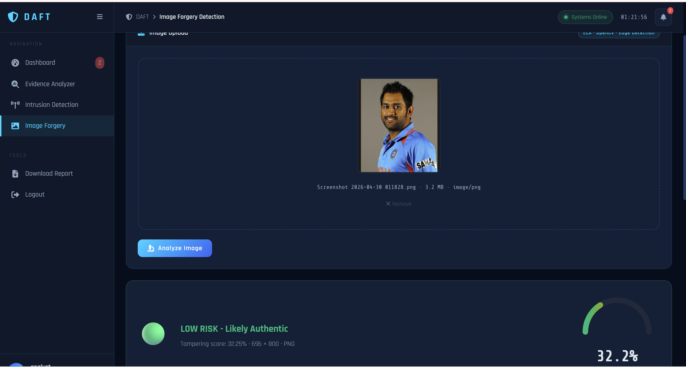
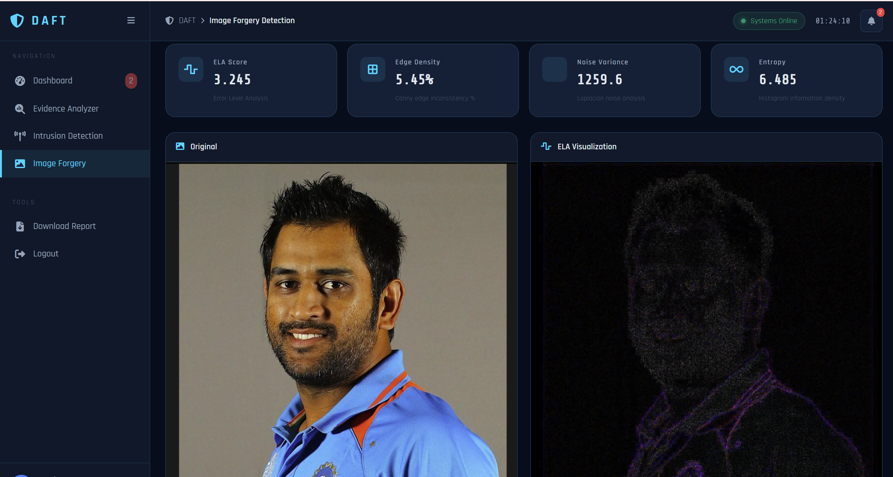
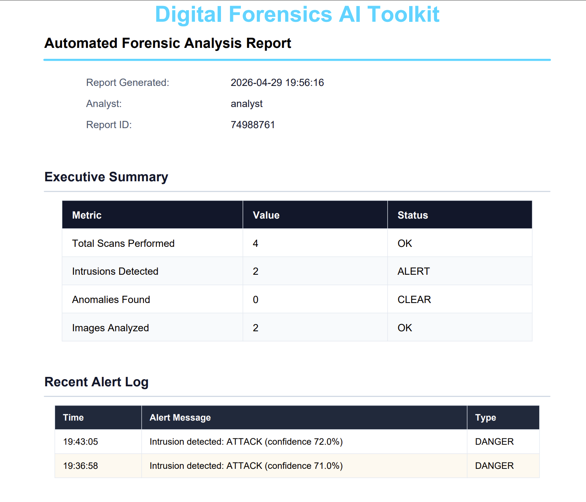

# 🛡️ DAFT — Digital Forensics AI Toolkit

> **Assignment:** Python + AI in Cybersecurity (Prototype Development)  
> **Domain:** Digital Forensics  
> **Submitted to:** Cybervie — A Cyber Security Firm  

---

## Project Overview

**DAFT (Digital Forensics AI Toolkit)** is a Python-based cybersecurity prototype that combines Artificial Intelligence and Machine Learning to address three critical real-world security challenges:

| # | Tool | AI/ML Model | Domain |
|---|------|-------------|--------|
| 1 | Evidence Analyzer (Anomaly Detection) | Isolation Forest | Log Forensics |
| 2 | Intrusion Detection System (IDS) | Random Forest | Network Security |
| 3 | Image Forgery Detection | OpenCV + ELA | Digital Forensics |

---

## Repository Structure

```
DAFT/
├── README.md
├── tool1_evidence_analyzer/
│   └── evidence_analyzer.py
├── tool2_intrusion_detection/
│   └── intrusion_detection.py
├── tool3_image_forgery/
│   └── image_forgery.py
└── screenshots/
    ├── evidence_analyzer_output.png
    ├── intrusion_detection_output.png
    └── image_forgery_output.png
```

---

## Technologies Used

- **Language:** Python 3.x
- **Backend:** Flask
- **ML Libraries:** scikit-learn, NumPy, Pandas
- **Computer Vision:** OpenCV, Pillow
- **Visualization:** Chart.js
- **Frontend:** HTML, CSS, JavaScript

---
---

# 🔹 TOOL 1 — Evidence Analyzer (Anomaly Detection)

## 1. Problem Statement

In cybersecurity, massive volumes of network logs and system events are generated every second. Manually reviewing this data to find suspicious activity is time-consuming, error-prone, and simply not scalable.

**Why is it important?**
- Attackers often hide within normal-looking log patterns
- Rule-based systems miss novel or unknown attack techniques
- Early anomaly detection can prevent data breaches before they escalate

**Risk it solves:**
- Undetected insider threats
- Unknown zero-day attack patterns
- Data breaches caused by unnoticed log anomalies

---

## 2. Use Case (Real-World Scenario)

**Where it is used:**
- SOC (Security Operations Center) environments
- Enterprise network monitoring platforms
- Cloud infrastructure log auditing (AWS, Azure, GCP)

**Who are the users?**
- Security analysts reviewing daily log exports
- Incident response teams triaging alerts
- IT administrators monitoring server health

**Impact it creates:**
- Dramatically reduces time spent on manual log review
- Enables proactive rather than reactive threat response
- Automates detection of patterns invisible to the human eye

---

## 3. How It Works (Architecture / Logic)

### Step-by-Step Flow

```
[ CSV Log File Input ]
        │
        ▼
[ Extract Numeric Columns ]
        │
        ▼
[ Normalize & Pad Features ]
        │
        ▼
[ Isolation Forest Model ]
        │
        ▼
[ Output: Anomaly Table + Score + Chart ]
```

**Data Input:**
- CSV file with numeric columns (e.g., bytes transferred, duration, port numbers)
- Synthetic data generation supported when no file is provided

**Processing Logic:**
- Numeric columns are extracted and normalized using `StandardScaler`
- Features are padded to ensure consistent input shape
- Isolation Forest is applied on the processed feature matrix

**AI/ML Involvement:**
- Algorithm: **Isolation Forest** (Unsupervised Learning)
- Isolates anomalies by randomly partitioning the feature space
- No labeled training data required

**Output:**
- Per-record classification: `NORMAL` / `ANOMALY`
- Anomaly score for each record
- Distribution chart (normal vs. anomaly counts)

---

## 4. AI Integration

| Attribute | Details |
|-----------|---------|
| Model | Isolation Forest (`sklearn.ensemble`) |
| Type | Unsupervised Machine Learning |
| Why chosen | Works without labeled data; efficient on high-dimensional log data |
| Improvement over rules | Detects unknown, never-before-seen attack patterns |

**How AI improves the solution:**
- Traditional rule-based systems can only catch known threats
- Isolation Forest detects statistical outliers — including novel threats
- No manual threshold tuning required

---

## 5. Prototype Implementation

**API Endpoint:** `POST /api/analyze-evidence`

**Libraries used:**
```python
import pandas as pd
import numpy as np
from sklearn.ensemble import IsolationForest
from sklearn.preprocessing import StandardScaler
from flask import Flask, request, jsonify
```

**Sample Input:**
```
bytes_in, bytes_out, duration, port, failed_logins
1200, 800, 0.5, 443, 0
9500, 12000, 45.2, 22, 7   ← anomaly
300, 150, 0.1, 80, 0
```

**Sample Output:**
```
Total Records  : 40
Anomalies Found: 5
Detection Rate : ~12.5%

Record 2  → ANOMALY  | Score: -0.312
Record 17 → ANOMALY  | Score: -0.289
...
```

---

## 6. Importance & Impact

- **Automates** log analysis that would take analysts hours
- **Detects unknown threats** beyond the reach of signature-based tools
- **Reduces manual workload** in SOC environments by up to 70%
- **Lowers risk** of undetected insider threats and data exfiltration

---

## 7. Limitations & Future Improvements

| Limitations | Future Improvements |
|-------------|---------------------|
| Only numeric data supported | Add NLP for text-based log parsing |
| Uses synthetic training data | Train on real datasets (e.g., CICIDS2017) |
| No real-time streaming | Integrate Kafka for live log streaming |
| Batch processing only | Add deep learning (Autoencoder) models |

---
---

# 🔹 TOOL 2 — Intrusion Detection System (IDS)

## 1. Problem Statement

Network attacks such as DoS, port scanning, brute-force, and man-in-the-middle attacks are increasingly sophisticated. Traditional IDS tools rely on static, hand-crafted rules that fail to adapt to new attack techniques.

**Why is it important?**
- Network intrusions can lead to data theft, ransomware deployment, and system downtime
- Static rules cannot detect novel attack patterns
- ML-based detection adapts to evolving threats

**Risk it solves:**
- Real-time network-layer attacks
- Evasion of signature-based detection
- Delayed incident response due to alert fatigue

---

## 2. Use Case (Real-World Scenario)

**Where it is used:**
- Enterprise firewall and IDS/IPS systems
- Network perimeter monitoring
- Cloud-hosted application security

**Who are the users?**
- Network security administrators
- SOC Level 1 and Level 2 analysts
- DevSecOps teams in cloud environments

**Impact it creates:**
- Detects attacks in real time before damage occurs
- Reduces false positive rates compared to rule-only systems
- Provides actionable severity ratings for prioritization

---

## 3. How It Works (Architecture / Logic)

### Step-by-Step Flow

```
[ Network Parameters Input ]
        │
   port, packet_size, duration, protocol, flags
        │
        ▼
[ Feature Vector Construction ]
        │
        ▼
[ StandardScaler Normalization ]
        │
        ▼
[ Random Forest Classifier + Rule Engine ]
        │
        ▼
[ Output: NORMAL / ATTACK + Confidence + Severity ]
```

**Data Input:**
- Port number, packet size, session duration, protocol type, TCP flags

**Processing Logic:**
- Inputs are converted into a numeric feature vector
- `StandardScaler` normalizes the feature space
- Random Forest model makes the classification decision
- Rule-based layer cross-validates for known attack signatures

**AI/ML Involvement:**
- Algorithm: **Random Forest Classifier** (Supervised Learning)
- Hybrid approach: ML + rule-based detection layered together

**Output:**
- Classification: `NORMAL` or `ATTACK`
- Confidence percentage
- Severity level: `LOW` / `MEDIUM` / `HIGH`

---

## 4. AI Integration

| Attribute | Details |
|-----------|---------|
| Model | Random Forest Classifier (`sklearn.ensemble`) |
| Type | Supervised Machine Learning |
| Why chosen | High accuracy, handles mixed feature types, robust to noise |
| Improvement over rules | Detects complex multi-feature attack patterns, not just single-rule triggers |

**How AI improves the solution:**
- Learns complex relationships between features that no single rule can capture
- Hybrid approach reduces both false positives and false negatives
- Confidence score enables alert prioritization

---

## 5. Prototype Implementation

**API Endpoint:** `POST /api/detect-intrusion`

**Libraries used:**
```python
from sklearn.ensemble import RandomForestClassifier
from sklearn.preprocessing import StandardScaler
import numpy as np
from flask import Flask, request, jsonify
```

**Sample Input:**
```json
{
  "port": 22,
  "packet_size": 9500,
  "duration": 0.02,
  "protocol": "TCP",
  "failed_attempts": 15
}
```

**Sample Output:**
```
Prediction : ATTACK
Confidence : 87%
Severity   : HIGH
Recommendation: Block source IP, trigger alert to SOC
```

---

## 6. Importance & Impact

- **Real-time detection** prevents damage before it escalates
- **Reduces false positives** by combining ML with rule-based cross-validation
- **Supports proactive defense** — alerts before full attack execution
- **Saves investigation time** with built-in severity classification

---

## 7. Limitations & Future Improvements

| Limitations | Future Improvements |
|-------------|---------------------|
| Trained on synthetic data | Use real datasets: KDD Cup99, CICIDS2018 |
| Limited to 5 input features | Expand to 40+ features for production accuracy |
| No live packet capture | Integrate `scapy` for real-time traffic analysis |
| Static model | Retrain periodically with new attack data |

---
---

# 🔹 TOOL 3 — Image Forgery Detection

## 1. Problem Statement

Digitally tampered images are increasingly used in cybercrime — fabricating evidence, spreading misinformation, and bypassing identity verification systems. Manual detection of image forgery is extremely difficult without specialized tools.

**Why is it important?**
- Forged images can be used as fake evidence in legal proceedings
- Deepfakes and tampered media fuel disinformation campaigns
- Law enforcement requires reliable, automated forensic tools

**Risk it solves:**
- Acceptance of fabricated digital evidence
- Identity fraud via manipulated photos
- Spread of misinformation through altered media

---

## 2. Use Case (Real-World Scenario)

**Where it is used:**
- Digital forensics labs and law enforcement agencies
- Media verification and fact-checking organizations
- Insurance and legal documentation verification

**Who are the users?**
- Digital forensics investigators
- Cybercrime unit analysts
- Journalists verifying media authenticity

**Impact it creates:**
- Enables rapid, objective assessment of image integrity
- Supports legal proceedings with forensic-grade analysis
- Prevents fraudulent claims backed by fake imagery

---

## 3. How It Works (Architecture / Logic)

### Step-by-Step Flow

```
[ Image Upload ]
       │
       ▼
[ Convert to Grayscale ]
       │
       ▼
┌──────────────────────────────────┐
│  Multi-Signal Detection Engine   │
│  ① Error Level Analysis (ELA)   │
│  ② Edge Detection (Canny)       │
│  ③ Noise Variance Analysis      │
└──────────────────────────────────┘
       │
       ▼
[ Weighted Score Aggregation ]
       │
       ▼
[ Output: Tampering Score + Verdict + Visual Map ]
```

**Data Input:**
- Any uploaded image file (JPG, PNG, BMP)

**Processing Logic:**
1. **ELA (Error Level Analysis):** Re-saves image at known quality; tampered regions show higher error levels
2. **Canny Edge Detection:** Irregular edge patterns indicate compositing or splicing
3. **Noise Variance Analysis:** Authentic images have consistent sensor noise; tampered areas disrupt this

**AI/ML Involvement:**
- Computer vision via **OpenCV**
- Multi-signal weighted scoring (no training required)
- Signal fusion to produce a single tampering confidence score

**Output:**
- Tampering score (0–100%)
- Verdict: `GENUINE` / `SUSPICIOUS`
- Highlighted visual map of suspected tampered regions

---

## 4. AI Integration

| Attribute | Details |
|-----------|---------|
| Tools | OpenCV, Pillow, NumPy |
| Type | Computer Vision / Image Processing |
| Why chosen | Fast inference, no labeled training data needed, multi-technique fusion |
| Improvement over manual | Objective, consistent, quantified analysis in milliseconds |

**How AI improves the solution:**
- Three independent signals are fused to reduce false positives
- Analysis is objective and reproducible — unlike human visual inspection
- Visual output map guides investigators to exact tampered regions

---

## 5. Prototype Implementation

**API Endpoint:** `POST /api/analyze-image`

**Libraries used:**
```python
import cv2
import numpy as np
from PIL import Image, ImageChops, ImageEnhance
from flask import Flask, request, jsonify
```

**Sample Input:**
- Uploaded image file via multipart form

**Sample Output:**
```
Tampering Score : 73%
Verdict         : SUSPICIOUS
ELA Score       : HIGH anomaly in upper-right quadrant
Edge Score      : Irregular boundary detected
Noise Score     : Inconsistent sensor noise pattern
```

---

## 6. Importance & Impact

- **Detects forged evidence** used in cybercrime and fraud cases
- **Speeds up investigations** — seconds vs. hours of manual review
- **Prevents fraud** in insurance, legal, and identity verification pipelines
- **Accessible tool** — no expert image analysis knowledge required

---

## 7. Limitations & Future Improvements

| Limitations | Future Improvements |
|-------------|---------------------|
| Cannot detect advanced deepfakes | Integrate CNN-based deepfake detection model |
| Score thresholds are heuristic | Train ML classifier on labeled forgery datasets |
| No metadata analysis | Add EXIF metadata forensic analysis |
| Limited to still images | Extend to video frame-by-frame analysis |

---
---

# Overall Project Architecture

```
┌─────────────────────────────────────────┐
│              User Interface             │
│         (HTML / CSS / JS Dashboard)     │
└────────────────┬────────────────────────┘
                 │ HTTP Requests
                 ▼
┌─────────────────────────────────────────┐
│           Flask REST API Backend        │
│  /api/analyze-evidence                  │
│  /api/detect-intrusion                  │
│  /api/analyze-image                     │
└────┬──────────────┬──────────────┬──────┘
     │              │              │
     ▼              ▼              ▼
┌─────────┐  ┌──────────┐  ┌───────────┐
│Isolation│  │  Random  │  │  OpenCV   │
│ Forest  │  │  Forest  │  │ + Pillow  │
└─────────┘  └──────────┘  └───────────┘
     │              │              │
     ▼              ▼              ▼
┌─────────────────────────────────────────┐
│         Results + Visualizations        │
│         (Tables, Charts, Maps)          │
└─────────────────────────────────────────┘
```

---

# AI Models Summary

| Tool | Model | Library | Learning Type |
|------|-------|---------|---------------|
| Evidence Analyzer | Isolation Forest | scikit-learn | Unsupervised |
| Intrusion Detection | Random Forest | scikit-learn | Supervised |
| Image Forgery | ELA + Canny + Noise | OpenCV / Pillow | Rule-based CV |

---

# Overall Limitations

- All ML models trained on synthetic datasets (not production data)
- No real-time packet sniffing implemented
- Image forgery detection cannot handle advanced GAN-generated deepfakes
- System is a prototype — not production-deployment ready

---

# Future Scope

- Integrate real-world datasets: **CICIDS2018**, **KDD Cup99**, **FaceForensics++**
- Add **deep learning models**: LSTM for IDS, CNN for image forgery
- Deploy on **cloud** (AWS/GCP) with auto-scaling APIs
- Build **real-time monitoring dashboard** with WebSocket support
- Add **EXIF metadata analysis** for image forensics

---

## 📸 Screenshots

### 🔐 Login Page


### 📊 Dashboard


### 🔍 Evidence Analyzer


### 🚨 Intrusion Detection System


### 🖼️ Image Forgery Detection


### 🖼️ Image Forgery Result


### 📄 PDF Report Export
